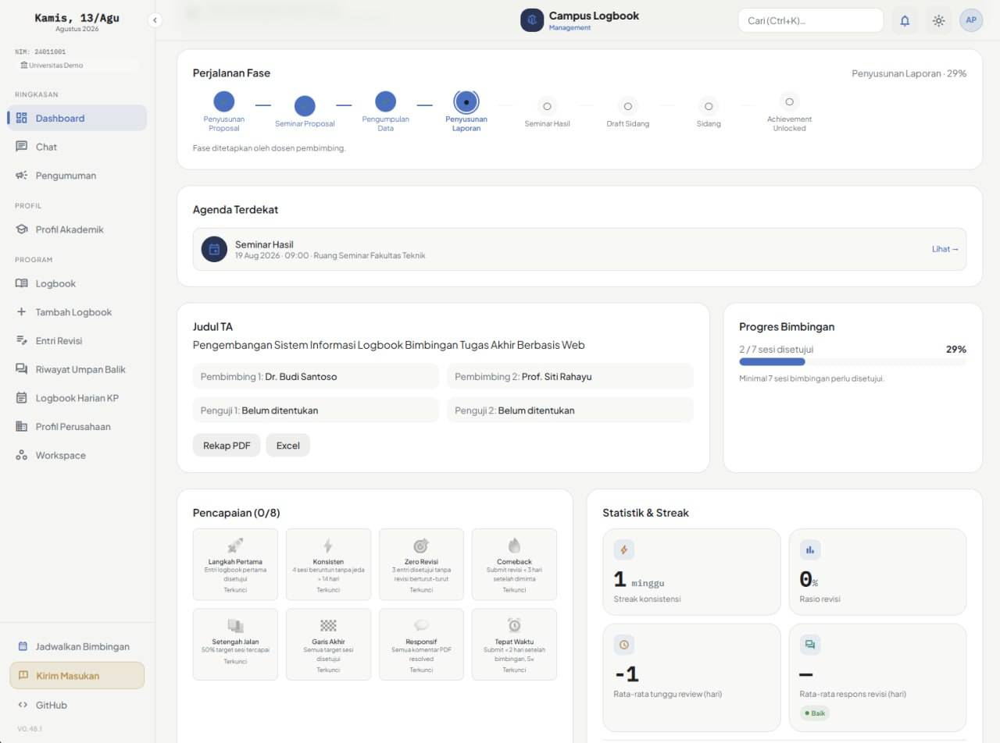
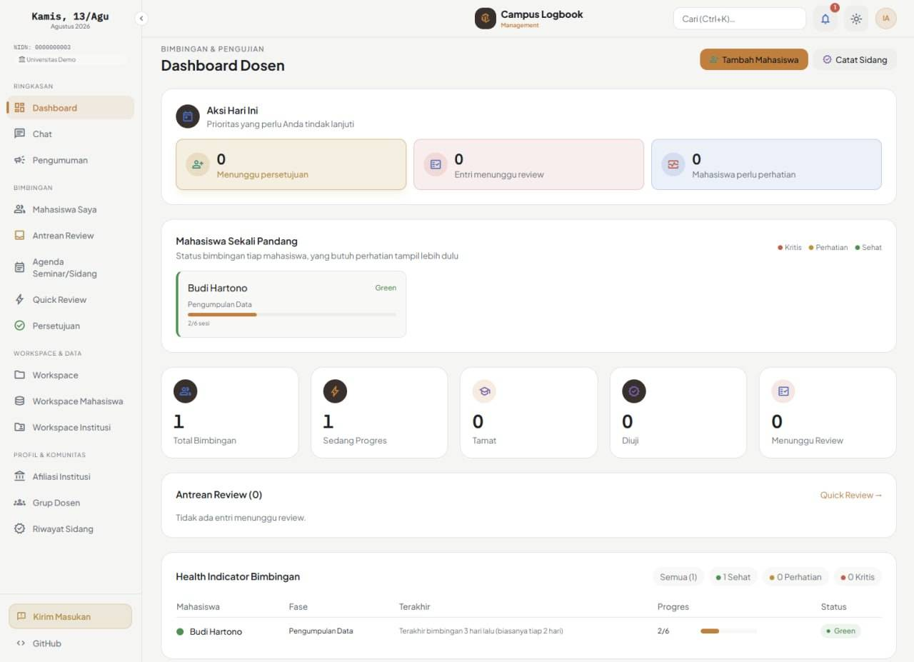

# Campus Logbook Management

Aplikasi web untuk mencatat, memantau, dan mengelola proses bimbingan tugas akhir/kerja praktik antara mahasiswa, dosen pembimbing, penguji, dan administrator.

## 🚀 Demo

- Live URL: <https://logbook.reloop.id>
- Dashboard mahasiswa:

  

- Dashboard dosen:

  

## 🧱 Tech Stack

- Frontend: Laravel Blade, Tailwind CSS, React, PDF.js
- Backend: Laravel 11, PHP 8.4
- Database: MySQL 8.4
- Cache & queue: Redis
- Realtime: Laravel Reverb
- Web server: Nginx
- Deployment: Docker Compose

## ✨ Fitur

- Logbook dan revision submission dengan alur review/approval.
- PDF viewer dengan anotasi, komentar, dan ekspor PDF/Excel.
- Dashboard khusus mahasiswa, dosen, dan administrator.
- Manajemen pembimbing, penguji, fase TA/KP, seminar, dan finalisasi tesis.
- Workspace file mahasiswa dengan kontrol akses.
- Chat realtime, announcement, notifikasi email, dan reminder.
- Role-based access control serta dukungan deployment personal dan institusi.

## 📦 Instalasi Lokal

### Prasyarat

- PHP >= 8.2 dan Composer
- Node.js dan npm
- SQLite atau MySQL

```bash
git clone https://github.com/relooplab/campus-logbook-management.git
cd campus-logbook-management

composer install
npm install
cp .env.example .env
php artisan key:generate
```

Untuk setup lokal sederhana, sesuaikan `.env` dengan database SQLite:

```dotenv
APP_ENV=local
APP_DEBUG=true
DB_CONNECTION=sqlite
DB_DATABASE=database/database.sqlite
CACHE_STORE=file
SESSION_DRIVER=file
QUEUE_CONNECTION=sync
BROADCAST_CONNECTION=log
MAIL_MAILER=log
```

Lanjutkan setup dan jalankan aplikasi:

```bash
touch database/database.sqlite
php artisan migrate --seed
php artisan storage:link
php artisan serve
```

Di terminal lain, jalankan asset watcher:

```bash
npm run dev
```

Aplikasi tersedia di <http://127.0.0.1:8000>.

## 🔧 Konfigurasi Environment

Salin `.env.example` menjadi `.env`, lalu sesuaikan minimal:

```dotenv
APP_ENV=production
APP_DEBUG=false
APP_URL=https://logbook.reloop.id
APP_KEY=<application-key>

DB_PASSWORD=<strong-database-password>
MYSQL_ROOT_PASSWORD=<strong-root-password>

REVERB_APP_ID=<unique-id>
REVERB_APP_KEY=<unique-key>
REVERB_APP_SECRET=<unique-secret>
```

Gunakan secret yang berbeda untuk setiap environment dan jangan commit file `.env`. Konfigurasi email, Redis, proxy, dan tautan eksternal tersedia di `.env.example`.

## 🏗️ Build & Production

Deployment production menggunakan Docker Compose:

```bash
cp .env.example .env
# Isi seluruh secret dan konfigurasi production di .env

docker compose build
docker compose up -d
docker compose exec logbook-ta-app php artisan migrate --force
docker compose ps
```

Pastikan `APP_DEBUG=false`, `APP_URL` memakai URL publik, dan port Mailpit (`8225`/`8226`) tidak diekspos ke internet. Untuk deployment resmi, gunakan script deployment pada environment production dan lakukan backup database sebelum migrasi.

## 🧪 Testing

```bash
php artisan test
```

## 📄 License

Licensed under the **Business Source License 1.1 (BSL 1.1)**. Lihat [LICENSE](LICENSE) untuk detail penggunaan dan ketentuan lisensi komersial.

Untuk pertanyaan lisensi: **dev@reloop.id**.

## 🔗 Referensi

- [User Guide](docs/USER-GUIDE.md)
- [API Reference](docs/API.md)
- [Deployment Modes](docs/MODE-SPEC.md)
- [Glossary](docs/GLOSSARY.md)
